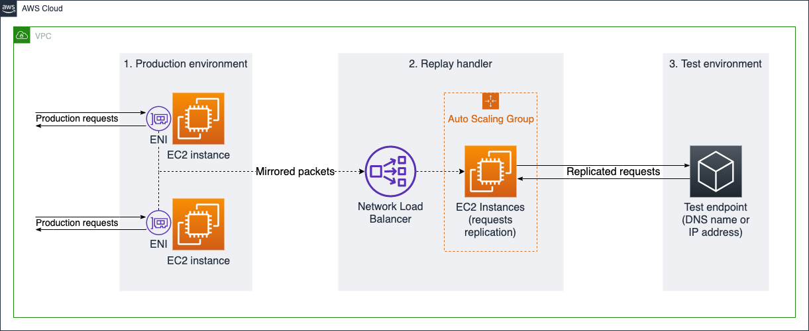

## Mirror production traffic to test environment with VPC Traffic Mirroring

This repository contains the artifacts for the AWS blog post [Mirror production traffic to test environment with VPC Traffic Mirroring](https://www.example.com/).

## Additional Considerations

#### Parameters

When creating the stack, you can optionally specify additional parameters. For example, you can use the parameter “ForwardPercentage” to define the percentage of requests that are replicated (by default, this is 100%). You can even choose to only replicate requests coming from a percentage of header values or remote addresses - for example, to mirror all requests that come from only a percentage of users (rather than a percentage of requests from all users). To do that, set the parameter “PercentageBy” to “header” or “remoteaddr”. When “PercentageBy” is set to “header”, you need to provide the header name in the parameter “PercentageByHeader”.

#### X-Forwarded headers

When the replay handler generates new requests, it manupulates the following headers:
- X-Forwarded-For: appends the IP of the client or the IP of the latest proxy.
- X-Forwarded-Port: sets it to the outermost port from the chain of client and proxies.
- X-Forwarded-Proto: sets it to the outermost protocol from the chain of client and proxies.
- X-Forwarded-Host: sets it to the outermost host from the chain of client and proxies.

#### Protocols support

The only protocol supported is HTTP. HTTPS is not supported. Therefore, SSL offloading should happen before the traffic reaches the EC2 instances in the production environment.

#### Scaling up the EC2 instances in the replay handler

If you increase the number of instances in the autoscaling group, traffic may get unbalanced in some cases due to how Network Load Balancer flow hash algorithm works. This may happen during scale out operations in the replay handler. To prevent this from happening, when a scale out action is needed from n to m instances (e.g. from 3 to 4), you can scale out to n+m first (e.g. to 3+4=7) and then scale in to m (e.g. 4). You can do this operation with two subsequent updates of the "InstanceNumber" parameter of the CloudFormation Stack. The CloudFormation template provided is already configured to remove the oldest instances first, so that traffic is re-distributed equally to the newer instances.

## Security

See [CONTRIBUTING](CONTRIBUTING.md#security-issue-notifications) for more information.

## License

This library is licensed under the BSD-3-Clause License. See the LICENSE file.
